# Weekend Wanderer - *Milestone Project Two*

**Find the final project here:**

## Table of Contents
1. [Project Overview](#project-overview)
2. [User Experience](#user-experience)
3. [Design Choices](#design-choices)
4. [Project Management](#project-management)
5. [Site Development & Features](#site-development--features)
    * [Universal Site Elements](#universal-site-elements)
    * [Explore Page](#explore-indexhtml)
    * [Inspiration Page](#inspiration-inspirationhtml)
    * [Contact Page](#contact-contacthtml)
6. [Pre-Deployment Testing](#pre-deployment-testing)
    * [Responsiveness](#)
    * [Browser Compatibility](#)
    * [Bug Fixes](#)
    * [Code Validation](#)
    * [User Story Testing](#)
    * [Feature Testing](#)
7. [Deployment](#deployment)
8. [Post-Deployment Testing](#post-deployment-testing)
    * [Responsiveness](#)
    * [Browser Compatibility](#)
    * [Bug Fixes](#)
    * [Lighthouse Testing](#)
    * [Feature Testing](#)
    * [Future Improvements](#)
9. [Credits & Acknowledgements](#credits--acknowledgements)

## Project Overview
Weekend Wanderer is an interactive outdoor adventure website intended to help users get out and explore the area they live in. The website consists of three pages: An Explore page, an Inspiration page and a Contact page. The Explore page is the home page of the site and consists of an interactive map where users can find hiking trails and walking/ running routes in their nearby area. The Inspiration page contains multiple pre-made guides showcasing the best outdoor areas around a certain town or region. The Contact page allows users to ask hiking-related questions as well as submit their own guides to be published to the website.

## User Experience
### Project Goals
The primary goal of the website is to provide a helpful tool where users can find outdoor areas near them that they would like to explore. Weekend Wanderer has two key target audience:
- People wanting to explore the natural area around them.
- People traveling to a new area looking for recommended outdoor areas.

### Persona One
**User:** Jade, 24

Jade is a Junior Marketing Executive based in Oxford, she enjoys the outdoors and hiking with her Fiancee.

**Jade's Goals:**
- Find new, highly rated areas to explore nearby during her weekends
- Find recommendations for hiking near other towns to help plan her next weekend getaway
- Read real people's reviews of near and far outdoor areas

**How the site helps Jade:**
- Allows her to find hiking trails within walking/ driving distance
- Provides pre-made guides showcasing the best trails to hike near a specific town or region

### Persona Two
**User:** Mark, 50 & Rebecca, 48

Mark and Rebecca live on the outskirts of Cardiff, Mark is a Civil Engineer and Rebecca is a Dentist. They now both work part-time and have taken up trail running together.

**Mark & Rebecca's Goals:**
- Explore new trails nearby
- Read reviews of running trails nearby
- Find a suitable place for an active weekend getaway

**How the site helps Mark & Rebecca:**
- Shows them trails within walking/ driving distance along with their rating
- Provides pre-made guides that showcase the best trails within certain areas

### Wireframes

#### Mk1 Wireframes
The first round of wireframes showed a very different plan for the website. The site consisted of a home page with a grid of outdoor imagery and a button that would direct users to the explore page. The explore page contained an interactive map where user's could select a place and add it to their saved trails for future getaways. And finally, an inspiration page containing pre-made travel guides.

Whilst these wireframes were helpful in the initial planning of the site, they were quite ambitious. The feature allowing users to save places is currently above my skillset as I cannot develop a backend to the site, therefore when the page is refreshed the saved places would be forgotten, therefore I chose to simplify the site and keep the focus on making an interactive map that could work across all screen sizes and truly help users find places to explore within their current area.

**Home Page**

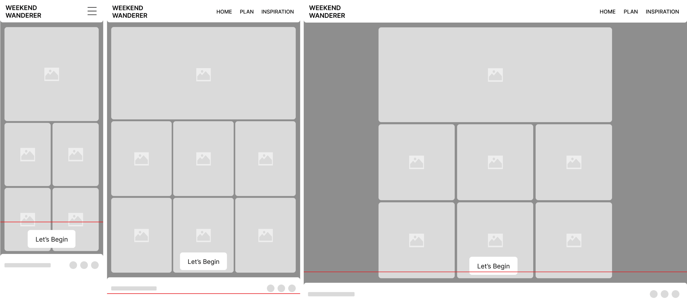

**Explore Page**

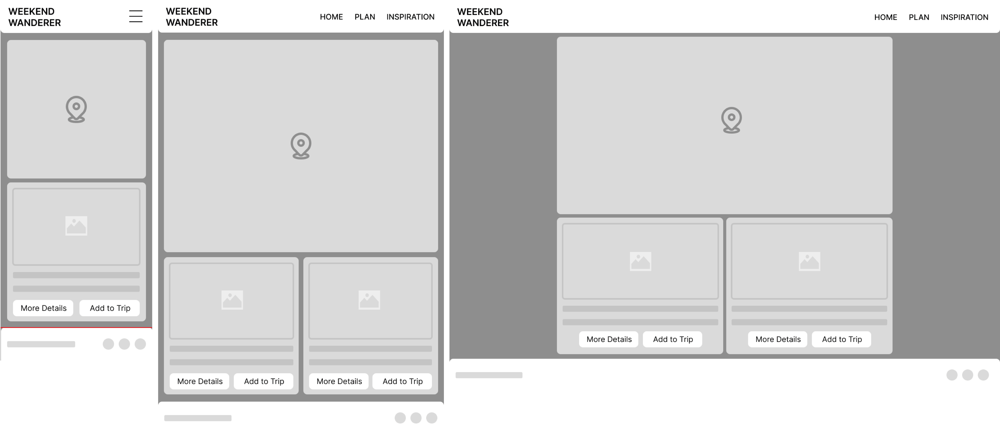

**Inspiration Page**

#### Mk2 Wireframes

The initial wireframes were edited and the overall site simplified to keep the focus on the interactive map as that is the main interactive element of the site.

**Explore Page**

The explore page consists of an interactive map based on the user's current location showing the top trails in their area. The user can zoom and pan this map to explore further or nearer to certain areas. Finally, underneath the map is details of a specific place the user has clicked on the map.

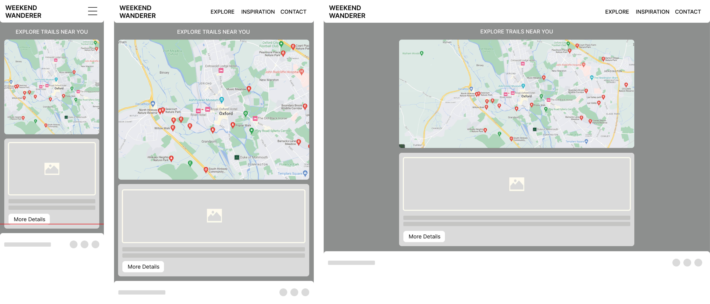

**Inspiration Page**

The inspiration page is similar to a blog where the content will continue to expand as guides are added to the site. For the purpose of this project there will be three guides each showcasing a different area and the best rated trails to visit in that area. Each page will consist of an interactive map with markers placed on the best places with a list to the side or below depending on screen size where the user can browse the places and their information.

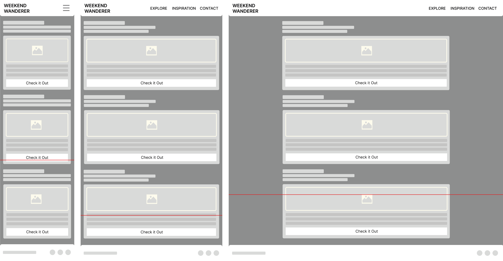

**Contact Page**

Finally, the contact page consists of a single, simple form where users can provide their name, email address and a question or can attach a document containing their own guide they would like to submit to the site.

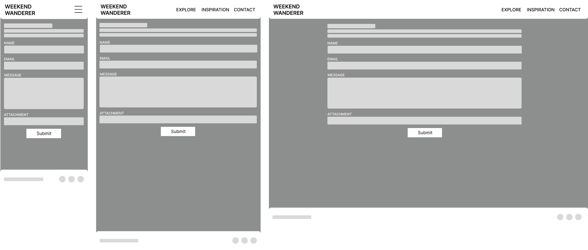

## Design Choices
### Colours
From looking at trends and current outdoor brands on the market, green and brown appear to be recurring colours used within the industry due to their resemblence of the outdoors. I used Adobe Colour to play around with combinations of different greens and browns until I came to a colour scheme that felt fitting. Here is the final colour scheme consisting of two shades of green, one shade of off-white and, two shades of brown.

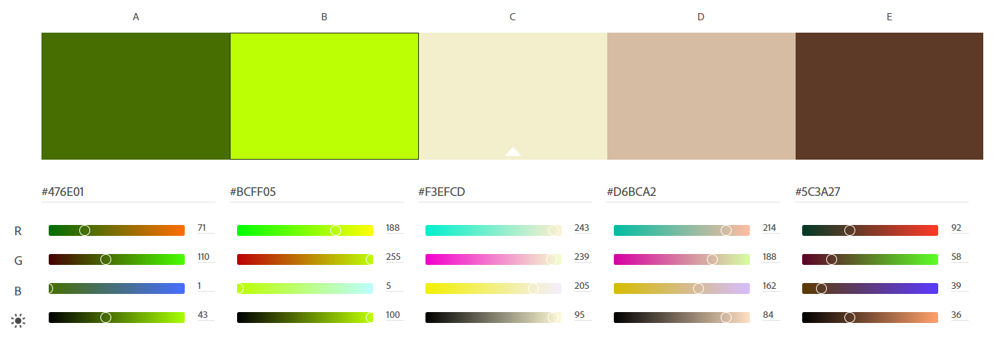

This colour scheme was tested using Adobe's accessibility tools to check how well the colours could be layered.

The greens were tested to ensure they could be used together and the dark brown was tested on the three possible background colours to check it would work as a text colour. The only combination that won't work is the dark brown and dark green.

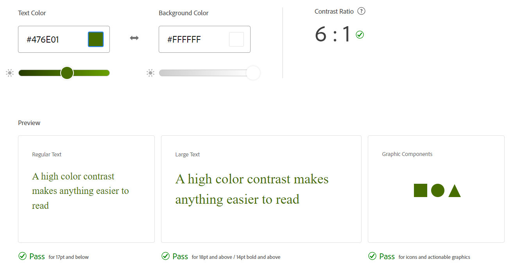

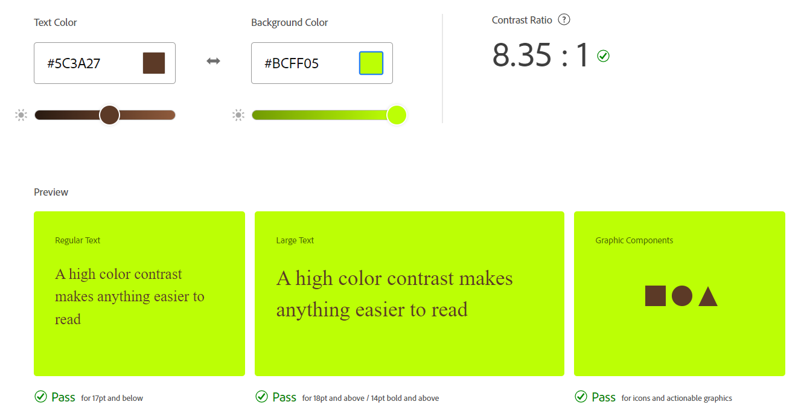

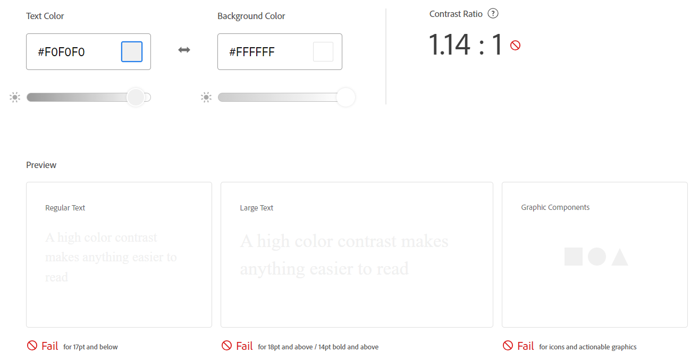

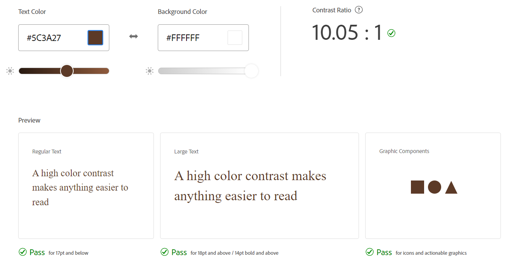

#### Hi-Fi Wireframes

After testing the five colours together for compatibility, they were implemented to the wireframes, different colours were tried in different positions until they felt correct. Here are the colour assignments and final hi-fi wireframes.

Dark Green #476E01 - Header & Footer Background
Light Green #BCFF05 - Buttons & Links
Dark Brown #5C3A27 - Text Colour
Light Brown #D6BCA2 - Text Fields & Section Backgrounds
Off-White #F3EFCD - Site Background, Hovers & Clicked Links

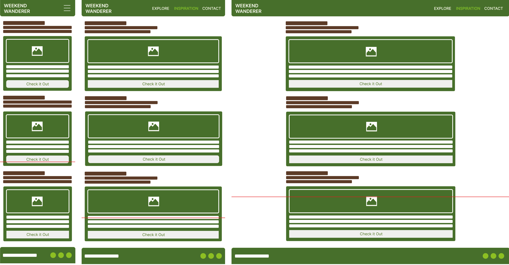

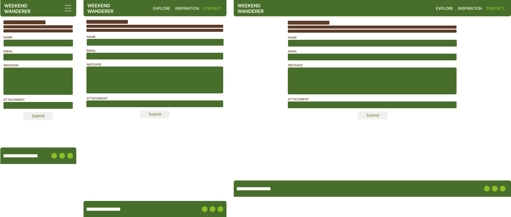

### Typography

The chosen fonts for this site are Google Fonts: Karla and Roboto.

Karla will be used for headers, taglines and navigation. Uppercase will be used for navigation and standard case everywhere else. It has been decided to use regular 400 and italic only where suitable.

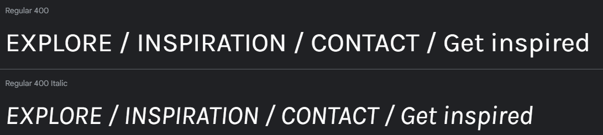

Roboto will be used for paragraph text, links and the footer. The following screenshots show Roboto at 16px in different weights.

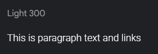
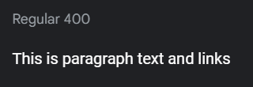
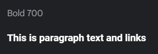

## Project Management
### Languages Used
- HTML5
- CSS3
- JavaScript
### Version Control
During site development GitHub was used to manage versions of each file, commits were made often and consisted of small bite-sized edits to individual features so it would be easier to roll back the site to a previous version if required. Details of the commits can be found here:

## Site Development & Features
### Universal Site Elements

### Explore (index.html)

### Inspiration (inspiration.html)

### Contact (contact.html)

## Pre-Deployment Testing

## Deployment

## Post-Deployment Testing

## Credits & Acknowledgements