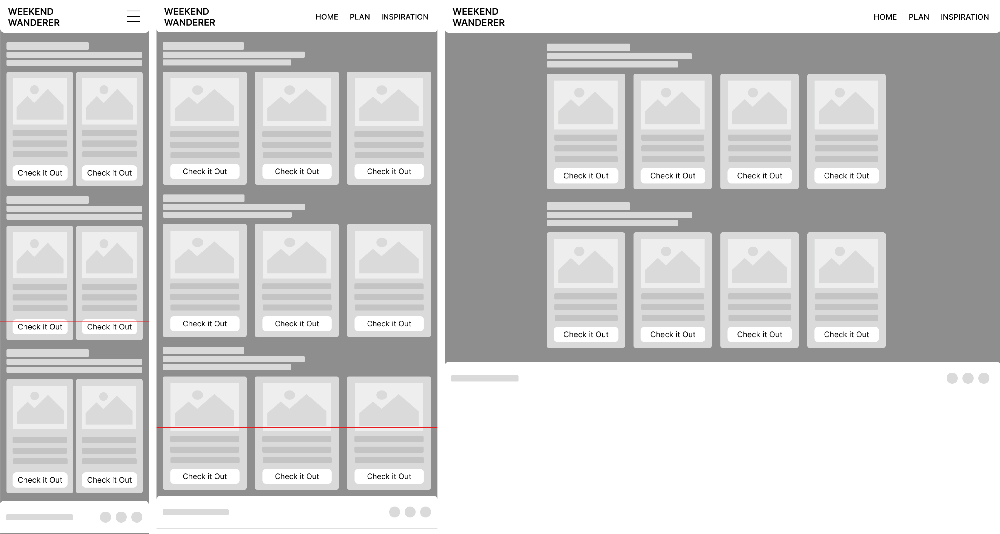
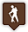
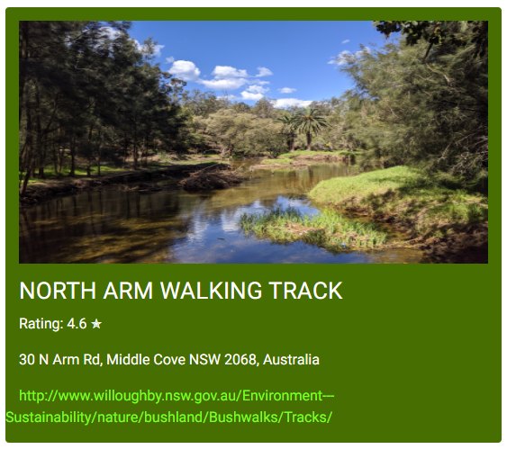
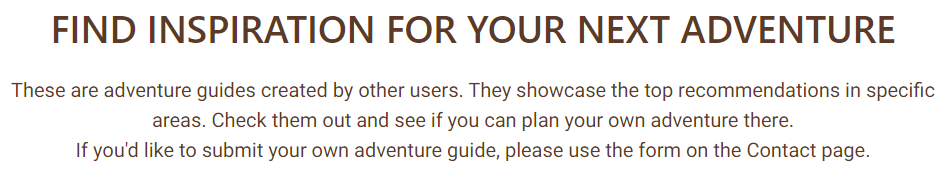

# Weekend Wanderer - *Milestone Project Two*

**Find the final project here:**

## Table of Contents
1. [Project Overview](#project-overview)
2. [User Experience](#user-experience)
3. [Design Choices](#design-choices)
4. [Project Management](#project-management)
5. [Site Development & Features](#site-development--features)
    * [Universal Site Elements](#universal-site-elements)
    * [Explore Page](#explore-indexhtml)
    * [Inspiration Page](#inspiration-inspirationhtml)
    * [Contact Page](#contact-contacthtml)
6. [Pre-Deployment Testing](#pre-deployment-testing)
    * [Responsiveness](#)
    * [Browser Compatibility](#)
    * [Bug Fixes](#)
    * [Code Validation](#)
    * [User Story Testing](#)
    * [Feature Testing](#)
7. [Deployment](#deployment)
8. [Post-Deployment Testing](#post-deployment-testing)
    * [Responsiveness](#)
    * [Browser Compatibility](#)
    * [Bug Fixes](#)
    * [Lighthouse Testing](#)
    * [Feature Testing](#)
    * [Future Improvements](#)
9. [Credits & Acknowledgements](#credits--acknowledgements)

## Project Overview
Weekend Wanderer is an interactive outdoor adventure website intended to help users get out and explore the area they live in. The website consists of three pages: An Explore page, an Inspiration page and a Contact page. The Explore page is the home page of the site and consists of an interactive map where users can find hiking trails and walking/ running routes in their nearby area. The Inspiration page contains multiple pre-made guides showcasing the best outdoor areas around a certain town or region. The Contact page allows users to ask hiking-related questions as well as submit their own guides to be published to the website.

## User Experience
### Project Goals
The primary goal of the website is to provide a helpful tool where users can find outdoor areas near them that they would like to explore. Weekend Wanderer has two key target audience:
- People wanting to explore the natural area around them.
- People traveling to a new area looking for recommended outdoor areas.

### Persona One
**User:** Jade, 24

Jade is a Junior Marketing Executive based in Oxford, she enjoys the outdoors and hiking with her Fiancee.

**Jade's Goals:**
- Find new, highly rated areas to explore nearby during her weekends
- Find recommendations for hiking near other towns to help plan her next weekend getaway
- Read real people's reviews of near and far outdoor areas

**How the site helps Jade:**
- Allows her to find hiking trails within walking/ driving distance
- Provides pre-made guides showcasing the best trails to hike near a specific town or region

### Persona Two
**User:** Mark, 50 & Rebecca, 48

Mark and Rebecca live on the outskirts of Cardiff, Mark is a Civil Engineer and Rebecca is a Dentist. They now both work part-time and have taken up trail running together.

**Mark & Rebecca's Goals:**
- Explore new trails nearby
- Read reviews of running trails nearby
- Find a suitable place for an active weekend getaway

**How the site helps Mark & Rebecca:**
- Shows them trails within walking/ driving distance along with their rating
- Provides pre-made guides that showcase the best trails within certain areas

### Wireframes

#### Mk1 Wireframes
The first round of wireframes showed a very different plan for the website. The site consisted of a home page with a grid of outdoor imagery and a button that would direct users to the explore page. The explore page contained an interactive map where user's could select a place and add it to their saved trails for future getaways. And finally, an inspiration page containing pre-made travel guides.

Whilst these wireframes were helpful in the initial planning of the site, they were quite ambitious. The feature allowing users to save places is currently above my skillset as I cannot develop a backend to the site, therefore when the page is refreshed the saved places would be forgotten, therefore I chose to simplify the site and keep the focus on making an interactive map that could work across all screen sizes and truly help users find places to explore within their current area.

**Home Page**

**Explore Page**

**Inspiration Page**

#### Mk2 Wireframes

The initial wireframes were edited and the overall site simplified to keep the focus on the interactive map as that is the main interactive element of the site.

**Explore Page**

The explore page consists of an interactive map based on the user's current location showing the top trails in their area. The user can zoom and pan this map to explore further or nearer to certain areas. Finally, underneath the map is details of a specific place the user has clicked on the map.

**Inspiration Page**

The inspiration page is similar to a blog where the content will continue to expand as guides are added to the site. For the purpose of this project there will be three guides each showcasing a different area and the best rated trails to visit in that area. Each page will consist of an interactive map with markers placed on the best places with a list to the side or below depending on screen size where the user can browse the places and their information.

**Contact Page**

Finally, the contact page consists of a single, simple form where users can provide their name, email address and a question or can attach a document containing their own guide they would like to submit to the site.

## Design Choices
### Colours
From looking at trends and current outdoor brands on the market, green and brown appear to be recurring colours used within the industry due to their resemblence of the outdoors. I used Adobe Colour to play around with combinations of different greens and browns until I came to a colour scheme that felt fitting. Here is the final colour scheme consisting of two shades of green, one shade of off-white and, two shades of brown.

This colour scheme was tested using Adobe's accessibility tools to check how well the colours could be layered.

The greens were tested to ensure they could be used together and the dark brown was tested on the three possible background colours to check it would work as a text colour. The only combination that won't work is the dark brown and dark green.

#### Hi-Fi Wireframes

After testing the five colours together for compatibility, they were implemented to the wireframes, different colours were tried in different positions until they felt correct. Here are the colour assignments and final hi-fi wireframes.

Dark Green #476E01 - Header & Footer Background
Light Green #BCFF05 - Buttons & Links
Dark Brown #5C3A27 - Text Colour
Light Brown #D6BCA2 - Text Fields & Section Backgrounds
Off-White #F3EFCD - Site Background, Hovers & Clicked Links

### Typography

The chosen fonts for this site are Google Fonts: Karla and Roboto.

Karla will be used for headers, taglines and navigation. Uppercase will be used for navigation and standard case everywhere else. It has been decided to use regular 400 and italic only where suitable.

Roboto will be used for paragraph text, links and the footer. The following screenshots show Roboto at 16px in different weights.

## Project Management
### Languages Used
- HTML5
- CSS3
- JavaScript
### Version Control
During site development GitHub was used to manage versions of each file, commits were made often and consisted of small bite-sized edits to individual features so it would be easier to roll back the site to a previous version if required. Details of the commits can be found here:

## Site Development & Features

### Universal Site Elements

#### External Links Used Across Site
Bootstrap CSS framework was used throughout the site to aid in developing a responsive, well-laid out website. This framework allowed the main structure of the site to be developed quickly, therefore more time could be spent focussing on the interactivity of the map, fine tuning elements and appropriately styling the site.

Font Awesome icons were used for the social links in the footer.

Two Google fonts were used throughout the site: Karla and Roboto. Details on the choice of these fonts can be found in the [Typography](#typography) section above.

#### Header & Main Navigation
The header of the site consists of the Weekend Wanderer logo on the left and the primary site navigation on the right. The background is dark green and the content is off-white but turns bright green when hovered to the active element. The header sites on top of the page content, therefore all page content has a top padding of 7em so nothing is hidden behind the header.

On screen sizes smaller than 768px wide the main navigation will become a hamburger button that can be toggled to show the navigation in a dropdown format.

Site header on screens 768px and above:

Site header on screens below 768px:

#### Footer
The footer consists of copyright information on the left and social links on the right all on a dark green background.

On screen sizes below 576px wide, the two columns of content stack and float on the right-hand side of the footer.

Site footer on screens 576px and above:

Site footer on screens below 576px:

### Explore (index.html)
The Explore page begins with a tagline and instructions describing how to use the interactive map to find places to explore nearby.

Beneath the tagline and instructions are the input criteria where the user can select a type of place they would like to search for from four options: 'Hikes', 'Nature Reserves', 'Beaches', and 'Landmarks'. They can then press submit to see 20 of the closest places of that type on the map below.

The input criteria consists of two bootstrap columns within a row so that on smaller screen sizes the criteria will stack, making it easier to use.

Input criteria on screens 576px and above:

Input criteria on screens below 576px:

The interactive map is the main focus of the Explore page and is in the centre of the page. It uses HTML5 geolocation to locate the user (if geolocation has been denied, it defaults to Sydney, Australia) and upon selecting a type of place and pressing 'Submit' the map will show the top 20 closest results for the chosen place type and zoom the map to fit the markers within it's bounds. It does this using the getNearbyPlaces function and the createMarkers function.

On screens over 768px wide, the padding either side of the map is set to 10% so that it doesn't fill all the blank space on the page and keeps the information digestible to the user.

There are four different marker icons, one for each type of place the user can select. 'If' and 'else if' statements are used in map.js to select the different marker icons depending on what place type has been selected.

Interactive map on screens 768px wide:

To the right are the four different marker icons:

The final element of the Explore page is the place card that appears under the map when the user clicks on one of the markers for more details.

The place details are shown in two bootstrap columns, with the photo on the left and the name, rating, address and website link on the right. This information is retrieved from the Google Places library using the getDetails function.

Place card on screens 768px and above:

Place card on screens below 576px:

### Inspiration (inspiration.html)
The Inspiration page begins with a tagline and brief description of the page.

Below the tagline are cards containing brief information about different places that adventure guides have been created for. The consist of an image, the name of the place, a short paragraph about the place and a button that links the user to the specific adventure guide for that place. The idea behind this page was that more guides could be added (similar to a travel blog) so user's could come to this page for inspiration about new places they can explore.

### Contact (contact.html)
The contact page consists of a single contact form for users to send enquiries about the site content and submit their own adventure guides for the Inspiration page.

The form contains fields for name, email address, message and an attachment. It is centred on the page at 70% of the screen width.

Contact form on screens 1200px wide:

Contact form on screens below 576px:

Upon completion of the contact form, the user is directed to a Thank You page, indicating their details have been recorded. This page still contains the site header, navigation bar and footer, meaning the user never leaves the site and can still return to the other site pages.

The Thank You page contains the following text:

## Pre-Deployment Testing

01/08/23:
- Map tested during development
- Header & footer responsiveness tested whilst applying padding
- Splitting card details into two columns for better appearance - Lots of js editing was required (adding two new variables and changing the while loops to remove all children of the new variables)

03/08/23:
- Allowed users to search for different types of places
- Old markers deleted
- Map bounds reset
- Hiker icon added

04/03/23:
- Set different markers for each user input
- Set specific user options in dropdown
- Started contact.html

05/08/23:
- Finished contact.html
- Started & finished thank_you.html
- Started & finished inspiration.html

06/08/23:
- Started guide page

### Responsiveness

### Browser Compatibility

### Bug Fixes
- Location found window doesn’t hide on search
- Responsiveness fixes
- Thank-you footer not at bottom
- Inspo imgs need cropping to size

### Code Validation

### User Story Testing

### Feature Testing

## Deployment

## Post-Deployment Testing

### Responsiveness

### Browser Compatibility

### Bug Fixes

### Lighthouse Testing

### Feature Testing

### Future Improvements
- Style map
- Turn website link into button
- Adventure guides a mix of types of poi

## Credits & Acknowledgements
Map Icons credit: https://mapicons.mapsmarker.com/markers/sports/nature-sports/hiking/?fbclid=IwAR0-2GqPnfXBoB_sRXuvAz-dREf3_LEz4HCJXUz_Ohz2_T7LWEm2Z3LP34A
oxford.jpg = Ben Seymour on Unsplash
bath.jpg = Alex Atudosie on Unsplash
falmouth.jpg = Kate Joyce on Unsplash