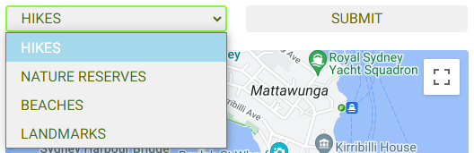
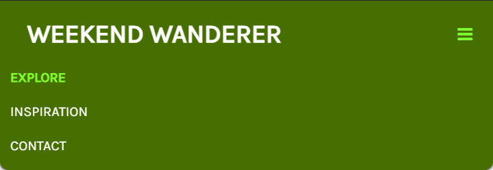
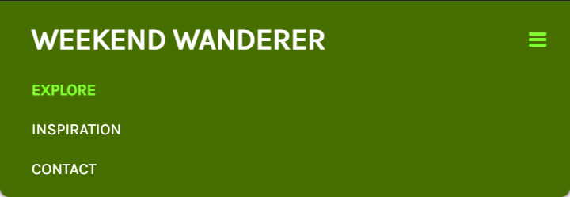

# Weekend Wanderer - *Milestone Project Two*

**Find the final project here:**

## Table of Contents
1. [Project Overview](#project-overview)
2. [User Experience](#user-experience)
3. [Design Choices](#design-choices)
4. [Project Management](#project-management)
5. [Site Development & Features](#site-development--features)
    * [Universal Site Elements](#universal-site-elements)
    * [Explore Page](#explore-indexhtml)
    * [Inspiration Page](#inspiration-inspirationhtml)
    * [Contact Page](#contact-contacthtml)
6. [Pre-Deployment Testing](#pre-deployment-testing)
    * [Responsiveness](#)
    * [Browser Compatibility](#)
    * [Bug Fixes](#)
    * [Code Validation](#)
    * [User Story Testing](#)
    * [Feature Testing](#)
7. [Deployment](#deployment)
8. [Post-Deployment Testing](#post-deployment-testing)
    * [Responsiveness](#)
    * [Browser Compatibility](#)
    * [Bug Fixes](#)
    * [Lighthouse Testing](#)
    * [Feature Testing](#)
    * [Future Improvements](#)
9. [Credits & Acknowledgements](#credits--acknowledgements)

## Project Overview
Weekend Wanderer is an interactive outdoor adventure website intended to help users get out and explore the area they live in. The website consists of three pages: An Explore page, an Inspiration page and a Contact page. The Explore page is the home page of the site and consists of an interactive map where users can find hiking trails and walking/ running routes in their nearby area. The Inspiration page contains multiple pre-made guides showcasing the best outdoor areas around a certain town or region. The Contact page allows users to ask hiking-related questions as well as submit their own guides to be published to the website.

## User Experience
### Project Goals
The primary goal of the website is to provide a helpful tool where users can find outdoor areas near them that they would like to explore. Weekend Wanderer has two key target audience:
- People wanting to explore the natural area around them.
- People traveling to a new area looking for recommended outdoor areas.

### Persona One
**User:** Jade, 24

Jade is a Junior Marketing Executive based in Oxford, she enjoys the outdoors and hiking with her Fiancee.

**Jade's Goals:**
- Find new, highly rated areas to explore nearby during her weekends
- Find recommendations for hiking near other towns to help plan her next weekend getaway
- Read real people's reviews of near and far outdoor areas

**How the site helps Jade:**
- Allows her to find hiking trails within walking/ driving distance
- Provides pre-made guides showcasing the best trails to hike near a specific town or region

### Persona Two
**User:** Mark, 50 & Rebecca, 48

Mark and Rebecca live on the outskirts of Cardiff, Mark is a Civil Engineer and Rebecca is a Dentist. They now both work part-time and have taken up trail running together.

**Mark & Rebecca's Goals:**
- Explore new trails nearby
- Read reviews of running trails nearby
- Find a suitable place for an active weekend getaway

**How the site helps Mark & Rebecca:**
- Shows them trails within walking/ driving distance along with their rating
- Provides pre-made guides that showcase the best trails within certain areas

### Wireframes

#### Mk1 Wireframes
The first round of wireframes showed a very different plan for the website. The site consisted of a home page with a grid of outdoor imagery and a button that would direct users to the explore page. The explore page contained an interactive map where user's could select a place and add it to their saved trails for future getaways. And finally, an inspiration page containing pre-made travel guides.

Whilst these wireframes were helpful in the initial planning of the site, they were quite ambitious. The feature allowing users to save places is currently above my skillset as I cannot develop a backend to the site, therefore when the page is refreshed the saved places would be forgotten, therefore I chose to simplify the site and keep the focus on making an interactive map that could work across all screen sizes and truly help users find places to explore within their current area.

**Home Page**

**Explore Page**

**Inspiration Page**

#### Mk2 Wireframes

The initial wireframes were edited and the overall site simplified to keep the focus on the interactive map as that is the main interactive element of the site.

**Explore Page**

The explore page consists of an interactive map based on the user's current location showing the top trails in their area. The user can zoom and pan this map to explore further or nearer to certain areas. Finally, underneath the map is details of a specific place the user has clicked on the map.

**Inspiration Page**

The inspiration page is similar to a blog where the content will continue to expand as guides are added to the site. For the purpose of this project there will be three guides each showcasing a different area and the best rated trails to visit in that area. Each page will consist of an interactive map with markers placed on the best places with a list to the side or below depending on screen size where the user can browse the places and their information.

**Contact Page**

Finally, the contact page consists of a single, simple form where users can provide their name, email address and a question or can attach a document containing their own guide they would like to submit to the site.

## Design Choices
### Colours
From looking at trends and current outdoor brands on the market, green and brown appear to be recurring colours used within the industry due to their resemblence of the outdoors. I used Adobe Colour to play around with combinations of different greens and browns until I came to a colour scheme that felt fitting. Here is the final colour scheme consisting of two shades of green, white, one shade of grey and one shade of brown.

This colour scheme was tested using Adobe's accessibility tools to check how well the colours could be layered.

All colours were tested on a white background to check if they could be used as text and if white would be suitable site background. The light green and the grey do not work as text on a white background, therefore will need alternative colour in between if used as text.

The light green and the grey were tested on the dark green and brown backgrounds to establish if either colour could work as a header/ footer background colour. It was also established that the brown and dark green could not be layered due to their contrast ratio.

#### Hi-Fi Wireframes

After testing the five colours together for compatibility, they were implemented to the wireframes, different colours were tried in different positions until they felt correct. Here are the colour assignments and final hi-fi wireframes.

- Dark Green #476E01 - Header & Footer Background
- Light Green #7FFF30 - Hovers & Clicked Links
- White #FFFFFF - Site Background, Text on coloured Backgrounds
- Grey #F0F0F0 - Buttons
- Dark Brown #5C3A27 - Text Colour

### Typography

The chosen fonts for this site are Google Fonts: Karla and Roboto.

Karla will be used for headers, taglines and navigation. Uppercase will be used for navigation and standard case everywhere else. It has been decided to use regular 400 and italic only where suitable.

Roboto will be used for paragraph text, links and the footer. The following screenshots show Roboto at 16px in different weights.

## Project Management
### Languages Used
- HTML5
- CSS3
- JavaScript
### Version Control
During site development GitHub was used to manage versions of each file, commits were made often and consisted of small bite-sized edits to individual features so it would be easier to roll back the site to a previous version if required. Details of the commits can be found here:

## Site Development & Features

### Universal Site Elements

#### External Links Used Across Site
Bootstrap CSS framework was used throughout the site to aid in developing a responsive, well-laid out website. This framework allowed the main structure of the site to be developed quickly, therefore more time could be spent focussing on the interactivity of the map, fine tuning elements and appropriately styling the site.

Font Awesome icons were used for the social links in the footer.

Two Google fonts were used throughout the site: Karla and Roboto. Details on the choice of these fonts can be found in the [Typography](#typography) section above.

#### Header & Main Navigation
The header of the site consists of the Weekend Wanderer logo on the left and the primary site navigation on the right. The background is dark green and the content is off-white but turns bright green when hovered to the active element. The header sites on top of the page content, therefore all page content has a top padding of 7em so nothing is hidden behind the header.

On screen sizes smaller than 768px wide the main navigation will become a hamburger button that can be toggled to show the navigation in a dropdown format.

Site header on screens 768px and above:

Site header on screens below 768px:

#### Footer
The footer consists of copyright information on the left and social links on the right all on a dark green background.

On screen sizes below 576px wide, the two columns of content stack and float on the right-hand side of the footer.

Site footer on screens 576px and above:

Site footer on screens below 576px:

### Explore (index.html)
The Explore page begins with a tagline and instructions describing how to use the interactive map to find places to explore nearby.

Beneath the tagline and instructions are the input criteria where the user can select a type of place they would like to search for from four options: 'Hikes', 'Nature Reserves', 'Beaches', and 'Landmarks'. They can then press submit to see 20 of the closest places of that type on the map below.

The input criteria consists of two bootstrap columns within a row so that on smaller screen sizes the criteria will stack, making it easier to use.

Input criteria on screens 576px and above:

Input criteria on screens below 576px:

The interactive map is the main focus of the Explore page and is in the centre of the page. It uses HTML5 geolocation to locate the user (if geolocation has been denied, it defaults to Sydney, Australia) and upon selecting a type of place and pressing 'Submit' the map will show the top 20 closest results for the chosen place type and zoom the map to fit the markers within it's bounds. It does this using the getNearbyPlaces function and the createMarkers function.

On screens over 768px wide, the padding either side of the map is set to 10% so that it doesn't fill all the blank space on the page and keeps the information digestible to the user.

There are four different marker icons, one for each type of place the user can select. 'If' and 'else if' statements are used in map.js to select the different marker icons depending on what place type has been selected.

Interactive map on screens 768px wide:

To the right are the four different marker icons:

The final element of the Explore page is the place card that appears under the map when the user clicks on one of the markers for more details.

The place details are shown in two bootstrap columns, with the photo on the left and the name, rating, address and website link on the right. This information is retrieved from the Google Places library using the getDetails function.

Place card on screens 768px and above:

Place card on screens below 576px:

### Inspiration (inspiration.html)
The Inspiration page begins with a tagline and brief description of the page.

Below the tagline are cards containing brief information about different places that adventure guides have been created for. The consist of an image, the name of the place, a short paragraph about the place and a button that links the user to the specific adventure guide for that place. The idea behind this page was that more guides could be added (similar to a travel blog) so user's could come to this page for inspiration about new places they can explore.

### Contact (contact.html)
The contact page consists of a single contact form for users to send enquiries about the site content and submit their own adventure guides for the Inspiration page.

The form contains fields for name, email address, message and an attachment. It is centred on the page at 70% of the screen width.

Contact form on screens 1200px wide:

Contact form on screens below 576px:

Upon completion of the contact form, the user is directed to a Thank You page, indicating their details have been recorded. This page still contains the site header, navigation bar and footer, meaning the user never leaves the site and can still return to the other site pages.

The Thank You page contains the following text:

## Pre-Deployment Testing

### Testing During Development

Testing was carried out during development to check features were working as expected and to identify issues immediately so they could be rectified. This was done using the Live Server extension for VSCode.

The interactive map on index.html was tested each time new section of code was added (eg. a new function) to check the new code was working as well as allow myself to better understand the code I was adding as I was using a lot of trial and error to get the code working properly since JavaScript is a new language to me.

Screenshot of initial interactive map:

Once the input criteria was added to the interactive map, through testing I found that the markers don't refresh if the user searches again irrespective of the place type. This took a lot of trial and error to resolve, in the end required a new function called deleteMarkers.

Screenshot to show deleteMarkers function:

After resolving the duplicate markers issue, the issue of the map bounds not resetting upon a new search was discovered. This meant implementing another action after the deleteMarkers function is called to reset the map bounds before resetting the search criteria.

Screenshot to show map bounds reset:

The header and footer were tested whilst the styling was being applied to ensure the margins & padding were correct on all screen sizes. This allowed a minor padding issue on the mobile screen menu to be picked up during development.

By testing responsiveness during development, this also allowed an issue with the place card image to be found. The original layout had the image above the details on the card on all screens, which meant on larger screens if the image retrieved from the places library was portrait it would end up severely stretched. Therefore, bootstrap columns were introduced to the place card so the image and details would appear in two columns side-by-side and could stack on smaller screens, keeping the image at a relatively normal aspect ratio.

Screenshots of place card columns before and after

### Bug Fixes

The site was initially tested on two screen sizes using Chrome developer tools, one mobile screen and one tablet screen. This was to aid in quickly resolving the main bugs related to responsiveness across the site before testing on a range of different screen sizes when more intricate fixes may be required.

#### Site Tested on iPhone XR

#### Site Tested on iPad Pro

From this testing, I found quite a lot of minor bugs, mainly to do with the styling.

On mobile screens the navbar toggler sits underneath the logo, instead the logo should stack and the toggler remain on the right of the navbar.

To resolve this issue, I initially tried to make the logo text stack on smaller screens, however this proved quite difficult. Therefore, I found the point at which the toggler stacked under the logo (419px) and created a media query for screens beneath 420px wide to set the logo font-size to 20px. This now means the toggler will only stack on screens beneath 320px wide.

The footer isn't sticky to the bottom of the page, therefore on pages with less content than the screen height or on widescreens the footer often isn't at the bottom of the screen.

To resolve this problem I incorporated some CSS flexbox code to set the body to flex it's items vertically and setting the footer margin-top to auto meaning it will fill the whole page since it's the last element in the html.

The inspiration page on mobile screens doesn't have any left or right margins, making the content fill the whole width of the screens.

This was resolved by removing the inspo-card class from the bootstrap columns that the content was within and adding it to row div around each element.

The images on the inspiration cards aren't optimised for the space they are filling on the page. They need reducing in file size and cropping to fit the space they are intended on the site. Also, the text on these place cards needs exchanging for site-specific text rather than lorem ipsum placeholder text.

This was resolved by editing the images to the same size and resolution, which is just big enough to show good image quality on screens above 1400px. And then adding flexbox css so the image would shrink rather than stretch or condense with the differing screen sizes.

The geolocation status window doesn't disappear once the user has searched for a place type.

The colour of the markers on the map doesn't suit the colour theme, therefore need changing to one of the green colours from the theme.

The web link being too long - Could be changed to a button

The above three issues were decided not major and would be resolved after pre & post deployment testing was finished to not hinder resolving true issues with the site and keep to the project deadline.

- Place card img doesn't fill space between 576px & 768px - Maybe make columns stack at 768px instead
- Inspo imgs need cropping to size - One for card & one for guide
- Add favicon

Finally, the thank-you page has index.html set as it's active page, this needs removing.

This was an easy fix and just required removing the active class from the nav-link html.

### Responsiveness

After completing the first round of responsiveness testing, the site was tested on the following screen sizes using Chrome developer tools.

Screen Width | | | | | Device | | | | |
---: | :---: | :---: | :---: | :---: | :---: | :---: | :---: | :---: | :---:
| | Galaxy S9+ (320px) | iPhone 6/7/8 (375px) | iPhone XR (414px) | iPad Mini (768px) | iPad Air (820px) | Surface Pro 7 (912px) | iPad Pro (1024px) | Desktop (1201px) | Desktop (2000px)
<= 576px | Good | Good | Good | NA | NA | NA | NA | NA | NA
576px < >= 992px | NA | NA | NA | Good | Good | Good | NA | NA | NA
992px < | NA | NA | NA | NA | NA | NA | Good | Good | Good
Links/ URLs work | Yes | Yes | Yes | Yes | Yes | Yes | Yes | Yes | Yes
Images work | Yes | Yes | Yes | Yes | Yes | Yes | Yes | Yes | Yes
Renders as expected | Yes | Yes | Yes | Yes | Yes | Yes | Yes | Yes | Yes

### Browser Compatibility

| | Browser | | | Notes
:--- | :--- | --- | --- | ---
| | Chrome | Edge | Firefox
Intended Appearance? | Good | Good | Good | Site appears as expected on all browsers tested
Intended Responsiveness? | Good | Good | Good | Site responds as expected on all browsers tested

### Code Validation

| | Validations | Notes
---: | --- | ---
HTML | Checked on: https://validator.w3.org/ | **Errors:** Missing favicon. Images don't have alt attributes. The ID: 'inspo-btn' has been re-used. **Warnings:** Sections don't have headers.
CSS | Checked on: https://jigsaw.w3.org/css-validator/ | No errors or warnings found.
JavaScript | Checked on: https://jshint.com/ | **Errors:** Missing '()' on line 15 invoking a constructor. Missing ';' on line 83 and 138. 'button' was an unused variable.

The above errors were resolved and committed all at once to github. A favicon was added, the ID: 'inspo-btn' was changed to a class and the JavaScript syntax issues were resolved.

### User Story Testing

User Story | Testing
--- | ---
As a user I want to find new, highly rated areas to explore nearby. | On the Explore page, select the type of place you are looking for and press 'Submit'. Nearby places of that type will be presented on the map. You can click any of them to see what their star rating out of 5 is.
As a user I want to find recommendations for hiking near other areas to help plan future trips. | On the Inspiration page scroll through the list of places that have adventure guides, they contain recommendations for hiking and other activities.
As a user I want to read real people's reviews of near and far outdoor areas. | On the Explore page, once a place type has been selected and the map is showcasing the nearby places, by clicking on a place you can see it's star rating and a link to a website where reviews can be found. Also, on the Inspiration page you can read people's reviews of a certain place.
As a user I want to find a suitable place for an active getaway. | On the Inspiration page, you can scroll through a list of places with adventure recommendations to find you next getaway.
As a user I want to be able to ask questions about the places shown on the site. | On the Contact page, you can ask questions as well as submit your own recommendations for adventure guides.

### Feature Testing

Feature | Action | Effect
--- | --- | ---
Logo (all pages) | Hover over | Cursor changes to a pointer, colour changes to #7FFF30
| | Click | Direct users to index.html
Site Navigation (<768px wide) (all pages) | Hover over toggler | Cursor changes to a pointer, colour changes to #7FFF30
| | Click toggler | Opens dropdown navigation menu
| | Hover over page | Cursor changes to a pointer, colour changes to #7FFF30
| | Click page | Directs user to selected page
Site Navigation (>=768px wide) (all pages) | Hover over page | Cursor changes to a pointer, colour changes to #7FFF30
| | Click page | Directs user to selected page
Place Type Criteria | Hover over | Bug: A hover needs adding to this feature to provide suitable feedback to the user
| | Click | Opens a dropdown selection of place types
| | Hover over | Highlights the place type
| | Click | Selects the place type
Submit Place Type | Hover over | Cursor changes to a pointer, colour changes to #7FFF30
| | Click | Shows nearby places of that type on the map below
Map (index.html, oxford.html, bath.html & falmouth.html) | Click & Drag | Pan around the map
| | Ctrl & Scroll | Zoom in or out of the map
Map Markers (index.html, oxford.html, bath.html & falmouth.html) | Click | An info-window appears above the marker and a place card is opened beneath the map
Place Card | Hover over link | Cursor changes to a pointer, colour changes to #7FFF30
| | Click | Directs user to external webpage for that place. Bug: This doesn't open in a new tab
Footer Links (all pages) | Hover over | Cursor changes to a pointer, colour changes to #7FFF30
| | Click | Opens selected social page in a new tab
Inspiration Card Button | Hover over | Cursor changes to a pointer, colour changes to #7FFF30
| | Click | Directs user to selected adventure guide
Contact Form | Hover over data fields | Cursor changes to a text cursore, border colour changes to #7FFF30
| | Click in data field | Border changes to black, typing cursor appears in data field
| | Hover over 'SUBMIT' | Cursor changes to a pointer, colour changes to #7FFF30
| | Click 'SUBMIT' | If data fields filled in correctly: Directs user to thank you page. If data fields not filled in correctly: Alerts user which field is missing or has incorrect data

## Deployment

## Post-Deployment Testing

### Responsiveness

### Browser Compatibility

### Bug Fixes

### Lighthouse Testing

### Feature Testing

### Future Improvements
- Style map
- Turn website link into button
- Adventure guides a mix of types of poi
- Use flexbox instead

## Credits & Acknowledgements
Map Icons credit: https://mapicons.mapsmarker.com/markers/sports/nature-sports/hiking/?fbclid=IwAR0-2GqPnfXBoB_sRXuvAz-dREf3_LEz4HCJXUz_Ohz2_T7LWEm2Z3LP34A
oxford.jpg = Ben Seymour on Unsplash
bath.jpg = Alex Atudosie on Unsplash
falmouth.jpg = Kate Joyce on Unsplash